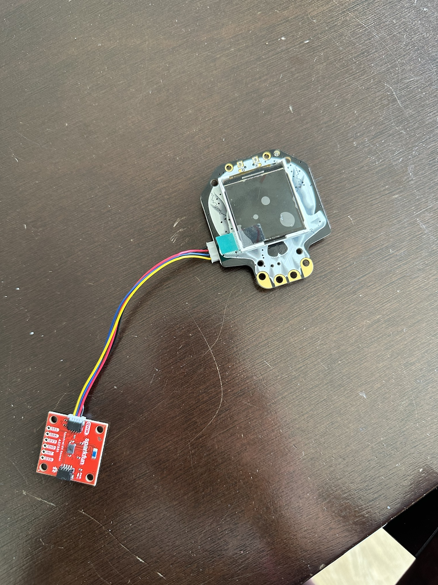

# AS7331 Example with Adafruit Hallowing M0

This is a demonstration sketch that uses the Stemm port and TFT display on a Hallowing M0 to display the UVA, UVB, and UVC channel values from a Sparkfun AS7331 sensor breakout in a nice self-contained form factor.

## To use
Open with the Arduino IDE, make sure you have the necessary boards and libraries installed per the `hallowingm0_arcadatest` example, and also install the `SparkFun AS7331 Arduino Library`. Follow https://learn.adafruit.com/adafruit-hallowing/arcada-libraries for directions. 

